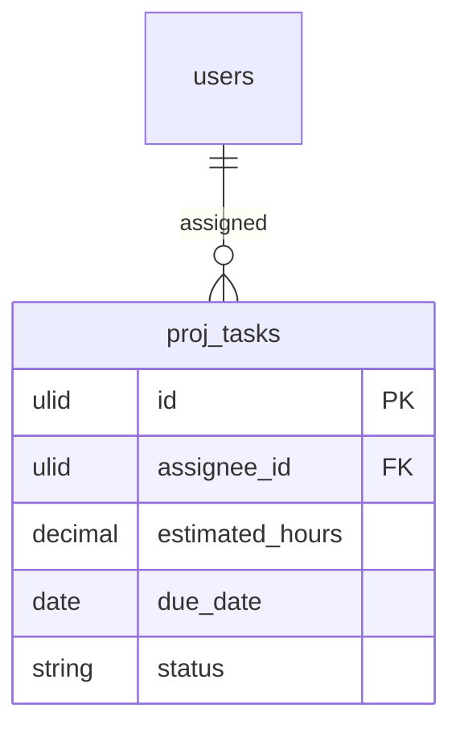

# Workload — Data Model

**Owns no tables.** Workload is a pure view.

## Reads (owned elsewhere)

| Table / source | Owner | Used for |
|---|---|---|
| `proj_tasks` | projects.tasks | assignee, estimated_hours, due_date, status |
| capacity (working-time) | hr.profiles | per-user daily capacity (default 8h when inactive) |
| `proj_resource_allocations` | projects.resources | allocation overlay |

## Read model (output DTO)

`WorkloadGridData` — `rows[]` (user, capacity_hours, `cells[]` {date, hours, level}).

## ERD

> No `proj_workload_*` tables. Capacity source is HR when active, else an 8h/day default constant.
