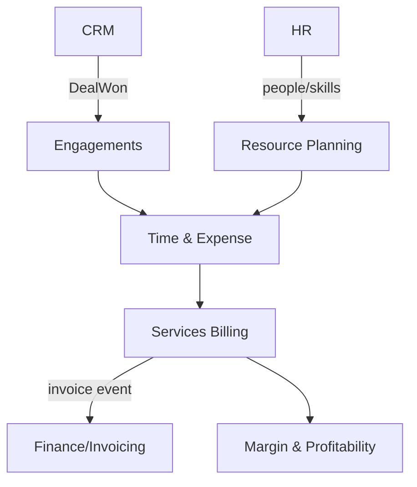

# Professional Services Automation

End-to-end delivery for services firms (agencies, consultancies, law firms): project delivery tracking, resource utilisation, time-and-materials / fixed-fee billing, and margin reporting. PSA is the "run a billable-hours business" layer on top of generic project tracking.

**Why deferred:** heavy overlap with the **Projects** and **Workplace** domains — much of task/time/scheduling already exists there. Only the billable-economics layer (rate cards, utilisation, WIP, margin) is genuinely distinct. Do not spec until there is a concrete professional-services customer segment, and reuse Projects/Workplace rather than duplicating it.

## Intended Modules *(assumed — no prior spec)*

| Module | Key | Purpose | UI kind guess |
|---|---|---|---|
| Engagements / Projects | `psa.engagements` | Billable engagement records (thin layer over Projects) | simple Filament resource |
| Resource Planning | `psa.resourcing` | Capacity, allocation, utilisation forecasting | custom Filament page (grid/heatmap) |
| Time & Expense | `psa.time` | Billable/non-billable time + reimbursables capture | custom Filament page (timesheet) |
| Rate Cards | `psa.rates` | Role/person rate cards, cost vs bill rates | simple Filament resource |
| Services Billing | `psa.billing` | T&M and fixed-fee invoicing, WIP, milestones | custom Filament page |
| Margin & Profitability | `psa.margin` | Realisation, margin, forecast dashboards | Filament widget (charts) |

## Cross-Domain Relations *(assumed)*

| Direction | Counterpart | Coupling | Note |
|---|---|---|---|
| consumes | projects | read | reuse tasks/schedule; do not duplicate |
| consumes | hr | read/event | people, skills, org units for resourcing |
| feeds | finance / invoicing | event | `ServicesInvoiceRaised` -> AR |
| consumes | crm | event | `DealWon` -> create engagement |

## Sketch

Full explosion into module + feature folders happens when this domain leaves **deferred** status. See [[_opportunities]].
