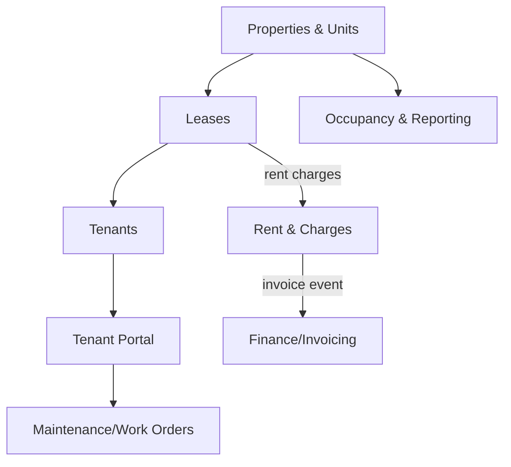

# Real Estate & Property

Property management for owners/managers: property and unit records, lease lifecycle, tenant management, maintenance/work orders, and occupancy + rent-roll reporting.

**Why deferred:** vertical-specific — only relevant when targeting property-management companies. Maintenance/work-order and tenant-portal pieces overlap conceptually with **Workplace** (facilities) and **Support** (ticketing); reuse those primitives rather than rebuilding. Spec fully only against a concrete property-management customer segment.

## Intended Modules *(assumed — no prior spec)*

| Module | Key | Purpose | UI kind guess |
|---|---|---|---|
| Properties & Units | `real-estate.properties` | Property/building/unit hierarchy and attributes | simple Filament resource |
| Leases | `real-estate.leases` | Lease terms, dates, renewals, escalations | custom Filament page (lifecycle) |
| Tenants | `real-estate.tenants` | Tenant records, contacts, communications | simple Filament resource |
| Maintenance / Work Orders | `real-estate.maintenance` | Requests, SLA tracking, vendor dispatch (mobile) | custom Filament page + portal |
| Rent & Charges | `real-estate.rent` | Rent roll, charges, arrears, payments | Filament widget + resource |
| Occupancy & Reporting | `real-estate.reporting` | Vacancy, occupancy, portfolio dashboards | Filament widget (charts) |
| Tenant Portal | `real-estate.portal` | Tenant self-service (requests, payments, docs) | Vue/Inertia portal |

## Cross-Domain Relations *(assumed)*

| Direction | Counterpart | Coupling | Note |
|---|---|---|---|
| feeds | finance / invoicing | event | rent charges -> AR / invoicing |
| consumes | workplace / facilities | read | reuse asset & work-order primitives |
| feeds | comms | event | lease-expiry / arrears notifications |
| consumes | dms | read | store leases, inspection docs |

## Sketch

Full explosion into module + feature folders happens when this domain leaves **deferred** status. See [[_opportunities]].
