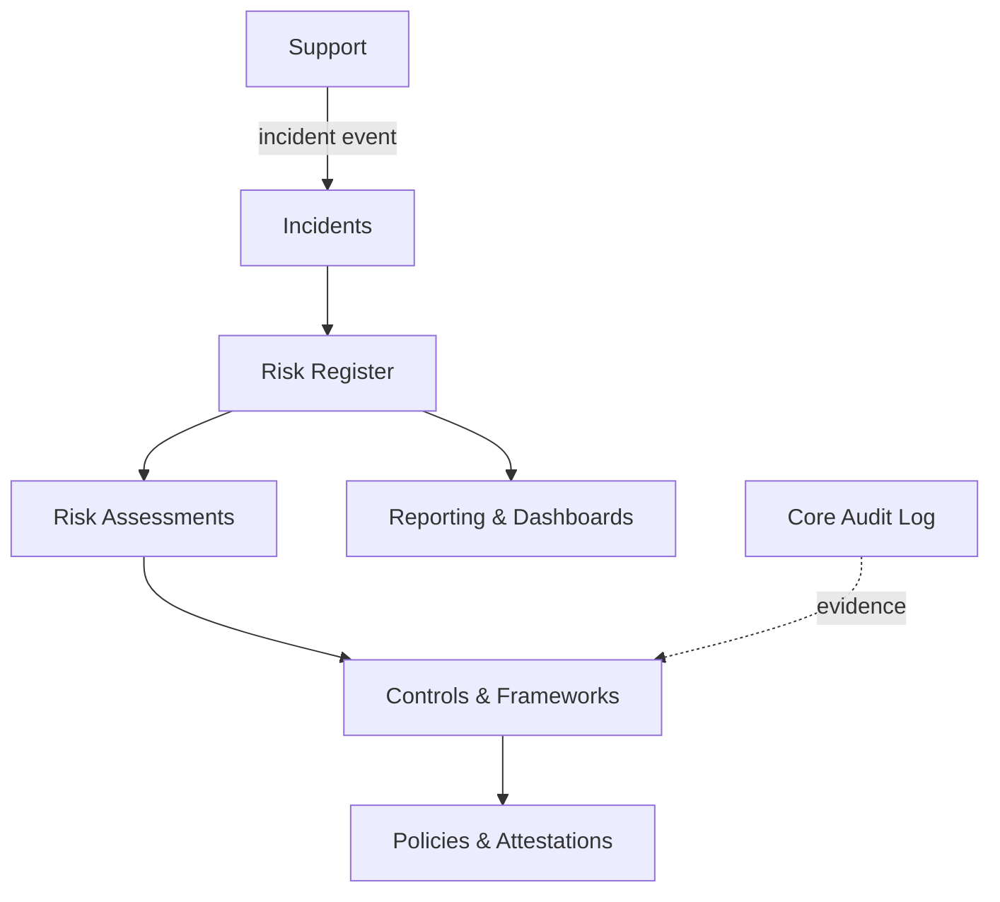

# Risk Management

Enterprise risk / GRC layer: risk register, risk assessments, control mapping to frameworks, incident tracking, and risk reporting. Gives regulated or enterprise-adjacent companies a structured way to identify, score, and mitigate risk with an auditable trail.

**Why deferred:** only relevant for regulated or enterprise-adjacent industries; overlaps with **Support** (incident handling) and **Core** (audit log) primitives, which should be reused. Spec fully only when a customer in such an industry requests it.

## Intended Modules *(assumed — no prior spec)*

| Module | Key | Purpose | UI kind guess |
|---|---|---|---|
| Risk Register | `risk.register` | Central catalogue of risks with owners & scores | simple Filament resource |
| Risk Assessments | `risk.assessments` | Likelihood x impact scoring, heat maps, reviews | custom Filament page (matrix) |
| Controls & Frameworks | `risk.controls` | Control library mapped to SOC2/ISO/etc. frameworks | custom Filament page (mapping grid) |
| Incidents | `risk.incidents` | Incident logging, response, root cause | custom Filament page (workflow) |
| Policies & Attestations | `risk.policies` | Policy library, acknowledgements, evidence | simple Filament resource |
| Reporting & Dashboards | `risk.reporting` | Risk posture, heat maps, framework coverage | Filament widget (charts) |

## Cross-Domain Relations *(assumed)*

| Direction | Counterpart | Coupling | Note |
|---|---|---|---|
| consumes | support | event | incidents/tickets can escalate into risk incidents |
| consumes | core / audit | read | evidence pulled from activity log |
| consumes | hr | event | attestation assignments to employees |
| feeds | comms | event | assessment-due / control-failure notifications |

## Sketch

Full explosion into module + feature folders happens when this domain leaves **deferred** status. See [[_opportunities]].
