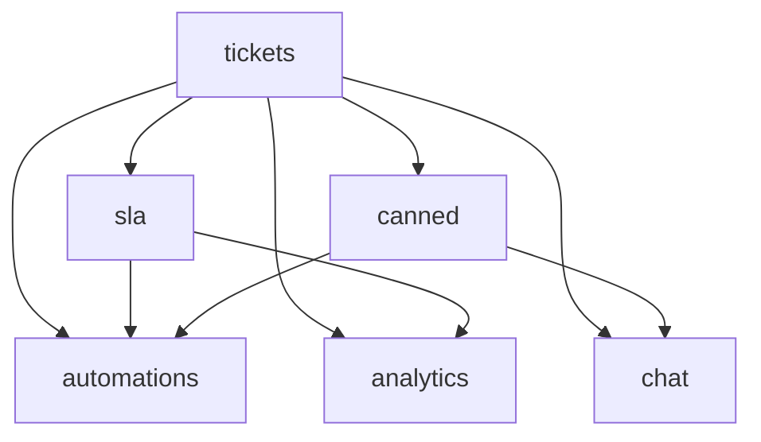

# Support & Help Desk

Customer ticket management, knowledge base, SLA tracking, live chat, and automation. **Panel:** `/support` (Orange) — Phase 2 (M7 in [[build/ROADMAP]]).

**Displaces**: Freshdesk, Zendesk (SMB tier), Intercom (support use case)

---

## Navigation Groups

- **Tickets** — Tickets, Ticket Inbox
- **Knowledge Base** — Articles, Categories
- **Live Chat** — Chat Queue, Transcripts
- **Analytics** — Support Dashboard
- **Settings** — SLA Policies, Canned Responses, Automations

---

## Modules

| Module | Key | Status | Priority | Depends on (intra-domain) |
|---|---|---|---|---|
| [[domains/support/tickets\|Tickets]] | `support.tickets` | planned | p2 | — (anchor) |
| [[domains/support/knowledge-base\|Knowledge Base]] | `support.kb` | planned | p2 | — |
| [[domains/support/sla\|SLA Management]] | `support.sla` | planned | p2 | tickets |
| [[domains/support/canned-responses\|Canned Responses]] | `support.canned` | planned | p2 | tickets |
| [[domains/support/automations\|Automations]] | `support.automations` | planned | p2 | tickets |
| [[domains/support/live-chat\|Live Chat]] | `support.chat` | planned | p2 | tickets |
| [[domains/support/support-analytics\|Support Analytics]] | `support.analytics` | planned | p2 | tickets |

Build order: tickets → kb → sla → canned → automations → chat → analytics.

## Dependency Graph (intra-domain)



## Cross-Domain Edges

| Direction | Event | Counterpart |
|---|---|---|
| Fires | `TicketResolved` (tickets) | support.analytics CSAT survey (v1 consumer); Marketing CSAT (P3) |
| Soft | — | crm.contacts requester linking |

Payload contract: [[architecture/event-bus]].

---

## Status Board (Dataview)

```dataview
TABLE module-key AS "Key", status AS "Status", priority AS "Priority"
FROM "domains/support"
WHERE type = "module"
SORT module-key ASC
```

---

## Key Patterns

- `spatie/laravel-model-states` — ticket status machine
- Custom pages — Ticket Inbox (#8 + Reverb), Chat Queue (#8 + Reverb), SLA Monitor, Support Dashboard
- `awcodes/filament-tiptap-editor` — KB articles (purified)
- [[architecture/websockets]] — chat is the heaviest Reverb consumer
- Public surfaces (help centre, CSAT, chat widget) = Vue + Inertia / built embed, all rate-limited
