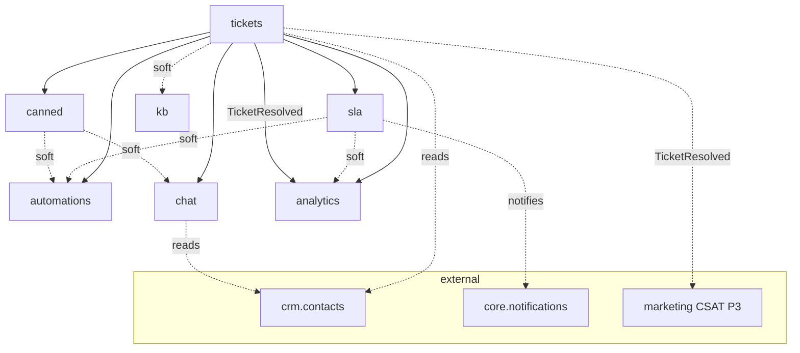

# Support & Help Desk — MOC

Customer ticket management, knowledge base, SLA tracking, live chat, canned responses, automations, and analytics. **Panel:** `/support` (Orange) — Phase 2 (M7 in [[_archive/ROADMAP]]).

**Displaces**: Freshdesk, Zendesk (SMB tier), Intercom (support use case). Opportunity radar: [[_opportunities]].

Every module is exploded to a folder (`<slug>/_module.md` + architecture / data-model / api / security / decisions / unknowns / `features/`). Constitution: [[../../decisions/decision-2026-06-20-full-mapping-conventions]].

---

## Navigation Groups

- **Tickets** — Tickets, Ticket Inbox
- **Knowledge Base** — Articles, Categories
- **Live Chat** — Chat Queue, Transcripts
- **Analytics** — Support Dashboard
- **Settings** — SLA Policies, Canned Responses, Automations

---

## Modules

| Module | Key | Priority | Build status | Kind highlights | Depends on (intra-domain) |
|---|---|---|---|---|---|
| [[tickets/_module\|Tickets]] | `support.tickets` | p2 | planned | resource + inbox custom-page (#8, Reverb) + widget; public-vue form (#16) | — (anchor) |
| [[knowledge-base/_module\|Knowledge Base]] | `support.kb` | p2 | planned | resource ×2 + public-vue help centre (#16) | tickets (soft) |
| [[sla/_module\|SLA Management]] | `support.sla` | p2 | planned | resource + monitor custom-page (#3, Reverb) + widget | tickets |
| [[canned-responses/_module\|Canned Responses]] | `support.canned` | p2 | planned | resource + composer embed (host #8) | tickets |
| [[automations/_module\|Automations]] | `support.automations` | p2 | planned | resource (backend-heavy engine) | tickets, sla (soft), canned (soft) |
| [[live-chat/_module\|Live Chat]] | `support.chat` | p2 | planned | chat custom-page (#8, Reverb) + read-only resource + render-hook toggle; public-vue widget (#16) | tickets, canned (soft) |
| [[support-analytics/_module\|Support Analytics]] | `support.analytics` | p2 | planned | dashboard page (#6) + widgets; public-vue CSAT (#16) | tickets, sla (soft) |

Build order: tickets → kb → sla → canned → automations → chat → analytics.

---

## Dependency Graph (intra-domain)



---

## Cross-Domain Edges

| Direction | Event / API | Counterpart |
|---|---|---|
| Fires | `TicketResolved` (tickets) | support.analytics CSAT (v1 consumer); marketing CSAT (P3) |
| Reads | `ContactService` (tickets, chat) | crm.contacts — requester/visitor find-or-create (soft) |
| Reads | business hours / timezone (sla) | core.settings |
| Feeds | breach / escalation notifications | core.notifications |
| Public | help centre, chat widget, CSAT page | unauthenticated — scoped guards + rate limits |

Payload contracts: [[../../architecture/event-bus]]. Data-ownership: [[../../security/data-ownership]] — each module writes only its own tables; ticket mutations from automations/chat go through `TicketService`.

---

## Status Board (Dataview)

```dataview
TABLE module AS "Module", build-status AS "Build", status AS "Status"
FROM "domains/support"
WHERE type = "module"
SORT module ASC
```

---

## Key Patterns

- `spatie/laravel-model-states` — ticket status machine ([[tickets/architecture]])
- Custom pages — Ticket Inbox (#8 + Reverb), Chat Queue (#8 + Reverb, heaviest consumer), SLA Monitor, Support Dashboard
- `awcodes/filament-tiptap-editor` — KB articles (purified)
- [[../../architecture/websockets]] — live chat is the heaviest Reverb consumer
- Public surfaces (help centre, CSAT, chat widget) = Vue + Inertia / built embed, all under scoped guards + rate-limited ([[../../security/data-ownership]])
