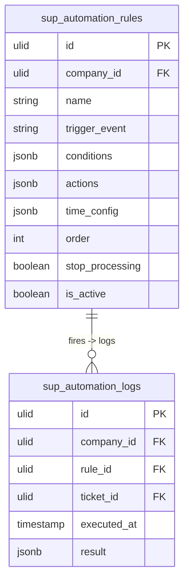

# Automations — Data Model

## sup_automation_rules

| Column | Type | Notes |
|---|---|---|
| id, company_id (indexed) | ulid | |
| name | string | |
| trigger_event | string | created / updated / status-changed / sla-warning / time-based |
| conditions | jsonb | `[{field, operator, value}]` AND |
| actions | jsonb | `[{type, config}]` |
| time_config | jsonb nullable | `{after_minutes, when: no-reply}` |
| order | int | evaluation order |
| stop_processing | boolean default false | halt chain after this rule |
| is_active | boolean default true | |
| deleted_at | timestamp nullable | |

## sup_automation_logs

| Column | Type | Notes |
|---|---|---|
| id, company_id (indexed) | ulid | |
| rule_id FK | ulid | |
| ticket_id FK | ulid | |
| executed_at | timestamp | |
| result | jsonb | actions applied / outcome |

Pruned after 90 days *(assumed)*. Unique-ish `(rule_id, ticket_id)` within window for time-based idempotency.

---

## ERD

> `sup_automation_logs.ticket_id` references `sup_tickets` (owned by [[../tickets/_module|support.tickets]], read-only). Actions mutate tickets via `TicketService`, never a direct write.
