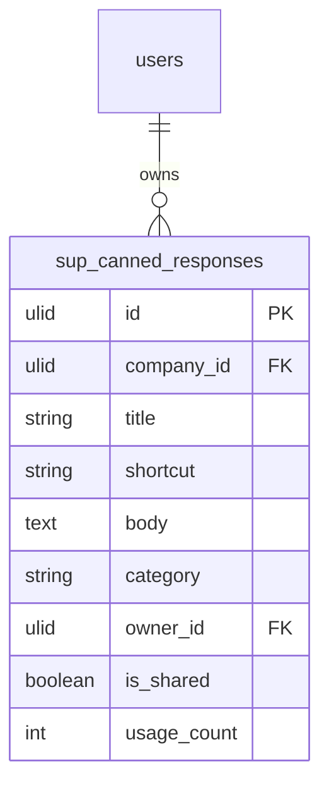

# Canned Responses — Data Model

## sup_canned_responses

| Column | Type | Notes |
|---|---|---|
| id, company_id (indexed) | ulid | |
| title | string | |
| shortcut | string | unique `(company_id, shortcut)`, slug-like `[a-z0-9-]+` |
| body | text | purified rich text |
| category | string nullable | |
| owner_id | ulid FK users | |
| is_shared | boolean default false | personal visible to owner only |
| usage_count | int default 0 | incremented on insert |
| deleted_at | timestamp nullable | |

**Indexes:** `(company_id, owner_id)`, unique `(company_id, shortcut)`.

---

## ERD

Single-table module. Ticket fields (`customer_name`, `agent_name`, `ticket_number`) are read at render time from `sup_tickets` (owned by [[../tickets/_module|support.tickets]]) — never written.
