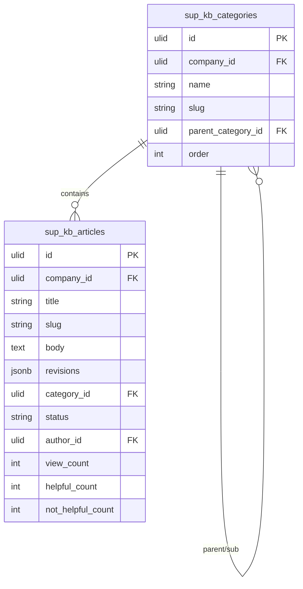

# Knowledge Base — Data Model

## sup_kb_articles

| Column | Type | Notes |
|---|---|---|
| id, company_id (indexed) | ulid | |
| title | string | searchable |
| slug | string | sluggable, unique `(company_id, slug)` |
| body | text | purified rich text |
| revisions | jsonb | `[{body, author_id, saved_at}]` capped 20 |
| category_id | ulid FK | |
| status | string default `draft` | draft / published |
| author_id | ulid FK users | |
| view_count | int default 0 | |
| helpful_count | int default 0 | |
| not_helpful_count | int default 0 | |
| published_at | timestamp nullable | |
| deleted_at | timestamp nullable | |

## sup_kb_categories

| Column | Type | Notes |
|---|---|---|
| id, company_id (indexed) | ulid | |
| name | string | |
| slug | string | |
| parent_category_id | ulid nullable | sub-categories |
| order | int | display order |
| deleted_at | timestamp nullable | |

---

## ERD

