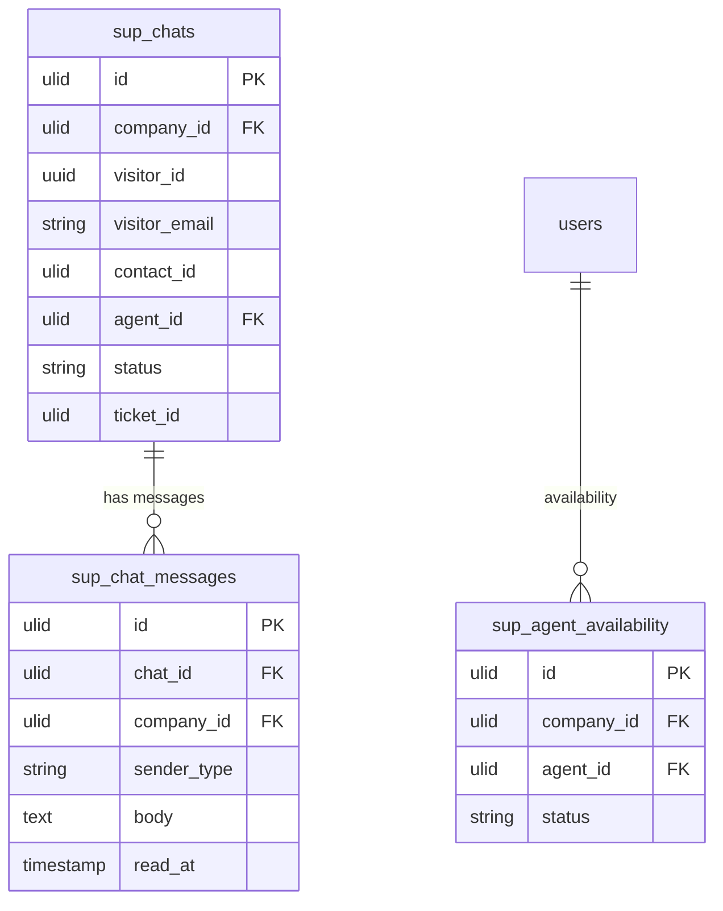

# Live Chat — Data Model

## sup_chats

| Column | Type | Notes |
|---|---|---|
| id, company_id (indexed) | ulid | |
| visitor_id | uuid | widget-local identity |
| visitor_name | string nullable | |
| visitor_email | string nullable | |
| contact_id | ulid nullable | CRM match (soft) |
| agent_id | ulid nullable FK users | |
| status | string default `active` | active / ended / missed |
| page_url | string nullable | |
| user_agent | string nullable | |
| started_at | timestamp | |
| ended_at | timestamp nullable | |
| ticket_id | ulid nullable | conversion / offline capture link |

## sup_chat_messages

| Column | Type | Notes |
|---|---|---|
| id, chat_id FK, company_id (indexed) | ulid | |
| sender_type | string | visitor / agent |
| body | text | purified, max 4000 |
| read_at | timestamp nullable | read receipt |
| created_at | timestamp | |

## sup_agent_availability

| Column | Type | Notes |
|---|---|---|
| id, company_id (indexed) | ulid | |
| agent_id FK | ulid unique | |
| status | string | online / away / offline |
| updated_at | timestamp | |

---

## ERD

> Cross-domain: `sup_chats.contact_id` references `crm_contacts` (read-only, [[../../crm/contacts/_module|crm.contacts]]); `sup_chats.ticket_id` references `sup_tickets` (created via `TicketService`, owned by [[../tickets/_module|support.tickets]]).
