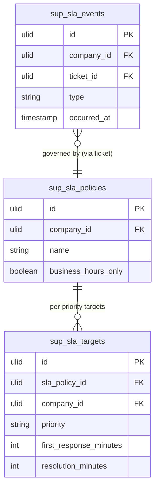

# SLA Management — Data Model

## sup_sla_policies

| Column | Type | Notes |
|---|---|---|
| id, company_id (indexed) | ulid | |
| name | string | |
| business_hours_only | boolean | count only business hours |
| deleted_at | timestamp nullable | |

## sup_sla_targets

| Column | Type | Notes |
|---|---|---|
| id, sla_policy_id FK, company_id | ulid | |
| priority | string | urgent/high/normal/low |
| first_response_minutes | int | min:1 |
| resolution_minutes | int | > first_response_minutes |

Unique `(sla_policy_id, priority)`.

## sup_sla_events

| Column | Type | Notes |
|---|---|---|
| id, company_id (indexed), ticket_id FK | ulid | |
| type | string | first_response_met / first_response_breached / resolution_met / resolution_breached / warning_sent |
| occurred_at | timestamp | |

Unique `(ticket_id, type)` — each event once per ticket (idempotency guard).

---

## ERD

> Cross-domain: `sup_sla_events.ticket_id` references `sup_tickets` (owned by [[../tickets/_module|support.tickets]], read-only from SLA). `sup_tickets.sla_policy_id` references a policy here.
