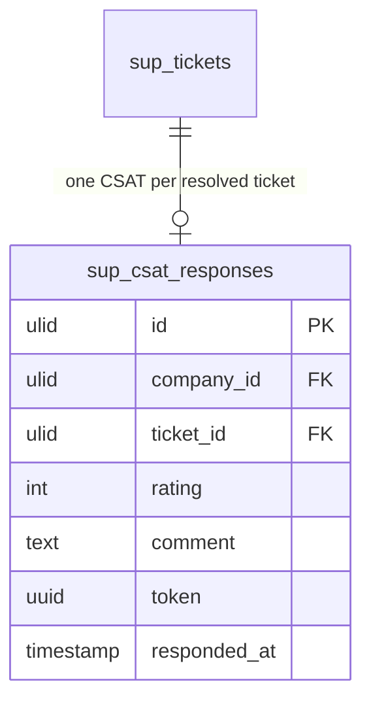

# Support Analytics — Data Model

## sup_csat_responses

| Column | Type | Notes |
|---|---|---|
| id, company_id (indexed) | ulid | |
| ticket_id FK | ulid | unique — one response per ticket |
| rating | int | 1–5 |
| comment | text nullable | |
| token | uuid | unique — public response link |
| responded_at | timestamp nullable | null = sent, unanswered |

The **only** table this module owns. All other metrics aggregate read-only from `sup_tickets`, `sup_ticket_replies`, `sup_sla_events`.

---

## ERD

> Cross-domain reads (no writes): `sup_tickets` + `sup_ticket_replies` (owned by [[../tickets/_module|support.tickets]]) and `sup_sla_events` (owned by [[../sla/_module|support.sla]]) power the aggregate metrics.
