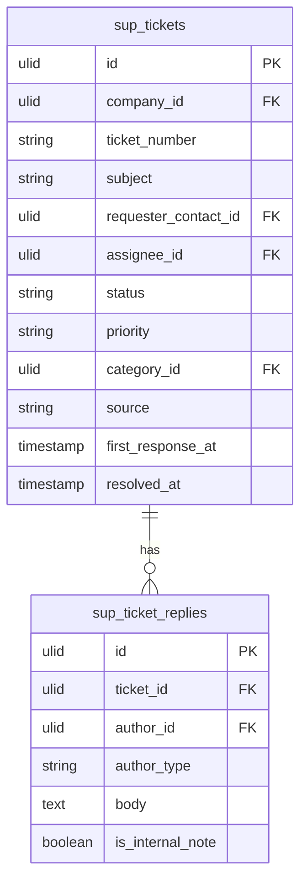

# Tickets

Inbound customer support ticket management: creation from multiple channels, assignment, status tracking, priority, and resolution workflow. The core of the Support domain.

## Core Features

- Ticket record: subject, description, requester (contact), assignee (agent), status, priority, category
- Ticket creation sources: email-to-ticket, web form, manual, API
- Status machine: `open → in_progress → waiting_on_customer → resolved → closed` (spatie/laravel-model-states)
- Priority: urgent, high, normal, low
- Assignment: manual or auto-assign rules (round-robin, by category)
- Ticket replies: threaded conversation, internal notes vs public replies
- Attachments via Media Library
- SLA timer per ticket (see [[domains/support/sla]])
- Linked to CRM contact/account if the requester exists
- Merge duplicate tickets
- Tags via spatie/laravel-tags
- Reopen closed tickets within configurable window

## Data Model

| Table | Key Columns |
|---|---|
| `sup_tickets` | company_id, ticket_number, subject, description, requester_contact_id, assignee_id, status, priority, category_id, source, sla_policy_id, first_response_at, resolved_at, closed_at |
| `sup_ticket_replies` | company_id, ticket_id, author_id, author_type (agent/customer), body, is_internal_note |
| `sup_ticket_categories` | company_id, name, default_assignee_id, sla_policy_id |

## Filament

**Nav group:** Tickets

- `TicketResource` — list (filter by status/priority/assignee/category), create, view
- `TicketInboxPage` (custom page) — email-client-style three-panel: filter list / ticket list / conversation view
- `TicketStatsWidget` — open count, overdue (SLA breach), avg first response time

## Cross-Domain Events

- Fires `TicketResolved` → Communications/Marketing (CSAT survey)

## Related

- [[domains/support/sla]]
- [[domains/support/canned-responses]]
- [[domains/support/automations]]
- [[domains/crm/contacts]]
