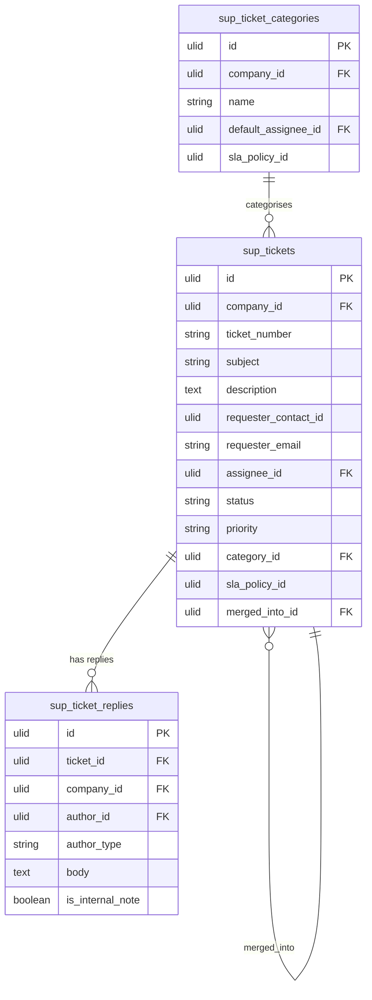

# Tickets — Data Model

## sup_tickets

| Column | Type | Constraints | Notes |
|---|---|---|---|
| id, company_id (indexed) | ulid | | |
| ticket_number | string | unique `(company_id, ticket_number)` | sequential `T-1042` |
| subject | string | not null | searchable |
| description | text | not null | purified |
| requester_contact_id | ulid | nullable | CRM link (soft) |
| requester_email | string | not null | standalone fallback |
| requester_name | string | nullable | |
| assignee_id | ulid | nullable FK users | |
| status | string | default `open` | state machine |
| priority | string | default `normal` | urgent/high/normal/low |
| category_id | ulid | nullable FK | |
| source | string | | email / form / manual / api |
| sla_policy_id | ulid | nullable | from category/priority |
| first_response_at | timestamp | nullable | first public agent reply |
| resolved_at | timestamp | nullable | |
| closed_at | timestamp | nullable | |
| merged_into_id | ulid | nullable FK self | merge target |
| deleted_at | timestamp | nullable | |

**Indexes:** `(company_id, status, priority)`, `(company_id, assignee_id, status)`, `(company_id, requester_email)`

---

## sup_ticket_replies

| Column | Type | Notes |
|---|---|---|
| id, ticket_id FK, company_id (indexed) | ulid | |
| author_id | ulid nullable | agent user; null = customer |
| author_type | string | agent / customer |
| body | text | purified |
| is_internal_note | boolean default false | never emailed |
| created_at | timestamp | first agent public reply sets ticket `first_response_at` |

---

## sup_ticket_categories

| Column | Type | Notes |
|---|---|---|
| id, company_id (indexed) | ulid | |
| name | string | |
| default_assignee_id | ulid nullable FK users | |
| sla_policy_id | ulid nullable | default SLA for the category |
| deleted_at | timestamp nullable | |

---

## ERD

> Cross-domain: `requester_contact_id` references `crm_contacts` (read-only, owned by [[../../crm/contacts/_module|crm.contacts]]); `sla_policy_id` references `sup_sla_policies` (owned by [[../sla/_module|support.sla]]).
