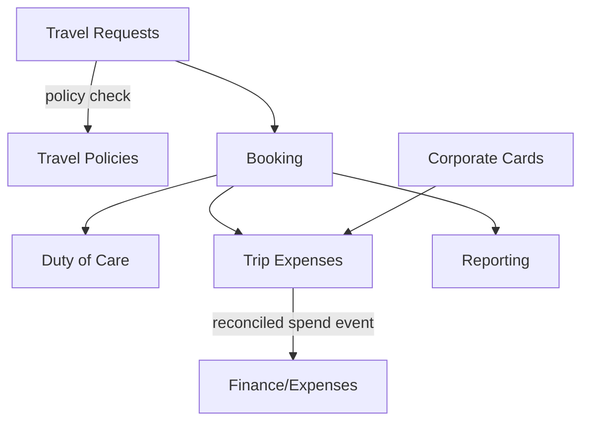

# Business Travel

Corporate travel and trip-expense management: travel requests and approvals, booking, policy enforcement, duty-of-care, and expense reconciliation. The SMB-tier answer to TravelPerk / SAP Concur.

**Why deferred:** requires GDS/booking integrations and card rails that are heavy to build; overlaps with **Finance** (expenses/reimbursement) which should own the money side. Spec fully only when there is concrete customer demand.

## Intended Modules *(assumed — no prior spec)*

| Module | Key | Purpose | UI kind guess |
|---|---|---|---|
| Travel Requests | `travel.requests` | Request-and-approve trips before booking | custom Filament page (approval flow) |
| Booking | `travel.booking` | Search/book flights, hotels, rail (via provider) | Vue/Inertia (portal) |
| Travel Policies | `travel.policies` | Policy rules, caps, class limits, approval routing | simple Filament resource |
| Duty of Care | `travel.duty-of-care` | Traveller location, risk alerts, check-ins | custom Filament page (map) |
| Trip Expenses | `travel.expenses` | Capture trip spend, receipts, reconciliation | custom Filament page |
| Corporate Cards | `travel.cards` | Card-linked spend, point-of-purchase policy | simple Filament resource |
| Reporting | `travel.reporting` | Spend, savings, policy-compliance dashboards | Filament widget (charts) |

## Cross-Domain Relations *(assumed)*

| Direction | Counterpart | Coupling | Note |
|---|---|---|---|
| feeds | finance / expenses | event | reconciled trip spend -> reimbursement/AP |
| consumes | hr | read | traveller profiles, org units for approval routing |
| feeds | comms | event | itinerary + duty-of-care alerts |
| consumes | core.billing | read | plan gating for booking features |

## Sketch

Full explosion into module + feature folders happens when this domain leaves **deferred** status. See [[_opportunities]].
