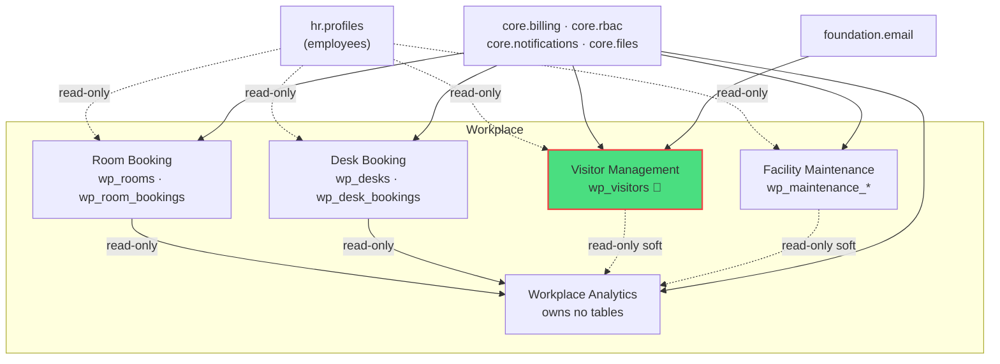

# Workplace & Facility

Room booking, desk booking, visitor management, facility maintenance, and analytics. **Panel:** `/workplace` (Lime) — Phase 3.

**Displaces**: Envoy, Robin, OfficeSpace, Skedda, YAROOMS, SwipedOn / Sign In App.

All 5 modules are exploded folder specs (`<slug>/_module.md` + architecture / data-model / api / security / decisions / unknowns / features). Constitution: [[../../decisions/decision-2026-06-20-full-mapping-conventions]]. Data-ownership boundary: [[../../security/data-ownership]].

---

## Navigation Groups

- **Meeting Rooms** — Rooms, Room Booking calendar
- **Desks** — Desks, Floor Map
- **Visitors** — Visitor Log, Kiosk
- **Maintenance** — Requests, Schedules
- **Analytics** — Workplace Dashboard

---

## Modules

| Module | Key | Priority | Build status | Kind highlights | Tables | Depends on (intra-domain) |
|---|---|---|---|---|---|---|
| [[room-booking/_module\|Room Booking]] | `workplace.rooms` | p3 | planned | resource + booking calendar (#4) | `wp_rooms`, `wp_room_bookings` | — (anchor) |
| [[desk-booking/_module\|Desk Booking]] | `workplace.desks` | p3 | planned | resource + floor map (#19) | `wp_desks`, `wp_desk_bookings` | — |
| [[visitor-management/_module\|Visitor Management]] | `workplace.visitors` | p3 | planned | resource + kiosk check-in page | `wp_visitors` 🔐 | — |
| [[maintenance/_module\|Facility Maintenance]] | `workplace.maintenance` | p3 | planned | resources + state-machine queue tabs | `wp_maintenance_requests`, `wp_maintenance_schedules` | — |
| [[workplace-analytics/_module\|Workplace Analytics]] | `workplace.analytics` | p3 | planned | dashboard (#6) + soft widgets | *(none — read-only)* | rooms (hard); desks/visitors/maintenance (soft) |

🔐 = holds encrypted external-person PII (`wp_visitors.name`, `wp_visitors.email`). See [[../../security/encryption]].

---

## Domain Map (MOC)



Solid = hard dependency / owned-write flow; dotted = read-only cross-domain query. Analytics writes nothing — every edge into it is query-side ([[../../security/data-ownership]]).

---

## Cross-Domain Edges

| Direction | Event / API | Counterpart | Notes |
|---|---|---|---|
| Reads | employee directory | [[../hr/employee-profiles/_module\|hr.profiles]] | hosts / bookers / reporters resolved read-only |
| Commands | notifications | [[../core/notifications/_module\|core.notifications]] | booking / arrival / assignment pings |
| Commands | mail | [[../foundation/email-setup/_module\|foundation.email]] | visitor confirmation + host arrival |
| Commands | file storage | [[../core/file-storage/_module\|core.files]] | maintenance photos (tenant-scoped) |
| Reads (intra) | utilisation data | rooms/desks/visitors/maintenance → analytics | analytics owns no tables |

**No cross-domain events fired yet.** Candidate events (`RoomBooked`, `DeskBooked`, `VisitorArrived`, `MaintenanceResolved`) are open questions in each module's `unknowns` — payload contracts would follow [[../../architecture/event-bus]] when decided.

**Data-ownership line:** every Workplace module writes only its own `wp_*` tables. Cross-domain effects are read-only queries (HR directory, sibling utilisation) or command APIs into core/foundation services — never a direct write into another domain's tables ([[../../security/data-ownership]]).

---

## Status Board (Dataview)

```dataview
TABLE module AS "Module", build-status AS "Build", status AS "Status"
FROM "domains/workplace"
WHERE type = "module"
SORT module ASC
```

---

## Key Patterns

- `saade/filament-fullcalendar` — room booking calendar.
- Custom pages — room calendar, desk floor-map (spatial), visitor kiosk.
- `spatie/laravel-model-states` — maintenance request status machine.
- Conflict prevention in transactions (rooms: overlap; desks: dual uniqueness).
- Visitor PII encrypted + purged at 12 months ([[../../architecture/data-lifecycle]], [[../../security/encryption]]).
- Analytics: read-only aggregator, cached, owns no tables.

---

## Related

- [[_opportunities|Opportunity Radar]]
- [[../../security/data-ownership]] · [[../../architecture/event-bus]] · [[../../architecture/data-lifecycle]]
- [[../../decisions/decision-2026-06-20-full-mapping-conventions]] · [[../../glossary]]
