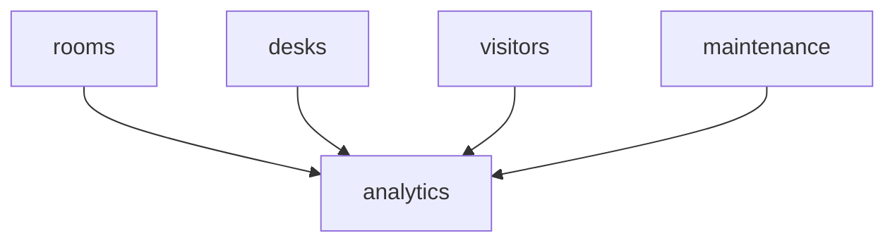

# Workplace & Facility

Room booking, desk booking, visitor management, facility maintenance, and analytics. **Panel:** `/workplace` (Lime) — Phase 3.

---

## Navigation Groups

- **Meeting Rooms** — Rooms, Room Booking
- **Desks** — Desks, Desk Booking
- **Visitors** — Visitor Log, Kiosk
- **Maintenance** — Requests, Schedules
- **Analytics** — Workplace Dashboard

---

## Modules

| Module | Key | Status | Priority | Depends on (intra-domain) |
|---|---|---|---|---|
| [[domains/workplace/room-booking\|Room Booking]] | `workplace.rooms` | planned | p3 | — (anchor) |
| [[domains/workplace/desk-booking\|Desk Booking]] | `workplace.desks` | planned | p3 | — |
| [[domains/workplace/visitor-management\|Visitor Management]] | `workplace.visitors` | planned | p3 | — |
| [[domains/workplace/maintenance\|Facility Maintenance]] | `workplace.maintenance` | planned | p3 | — |
| [[domains/workplace/workplace-analytics\|Workplace Analytics]] | `workplace.analytics` | planned | p3 | rooms |

## Dependency Graph (intra-domain)



## Cross-Domain Edges

No events. Hosts/bookers/reporters are employees (hr.profiles hard dep on the people-facing modules).

---

## Status Board (Dataview)

```dataview
TABLE module-key AS "Key", status AS "Status", priority AS "Priority"
FROM "domains/workplace"
WHERE type = "module"
SORT module-key ASC
```

---

## Key Patterns

- `saade/filament-fullcalendar` — room booking calendar
- Custom pages — booking calendar (#4), floor map (#11-style), kiosk (#7)
- `spatie/laravel-model-states` — maintenance request status
- Conflict prevention in transactions (rooms: overlap; desks: dual uniqueness)
- Visitor PII purged at 12 months ([[architecture/data-lifecycle]])
