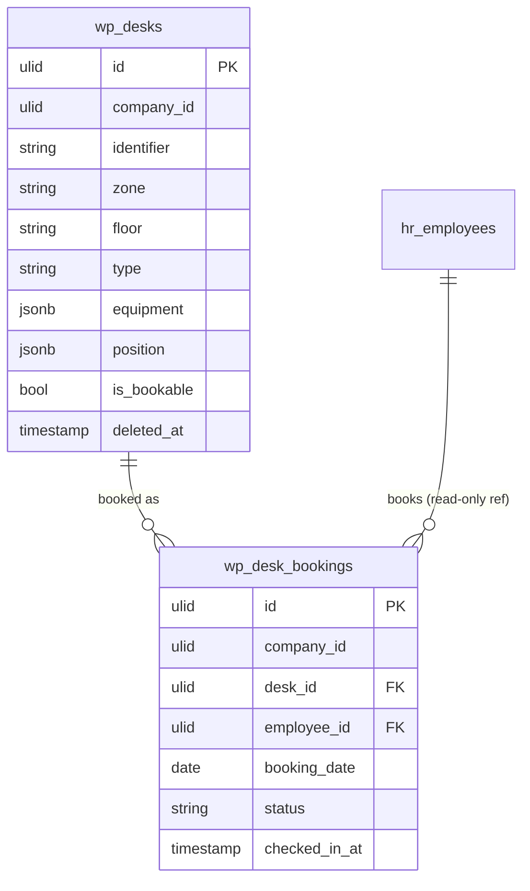

# Desk Booking — Data Model

## `wp_desks`

| Column | Type | Notes |
|---|---|---|
| `id` | ulid | PK |
| `company_id` | ulid | Indexed, `BelongsToCompany` |
| `identifier` | string | Unique per company (e.g. "3F-12") |
| `zone` | string | |
| `floor` | string | |
| `type` | string | standing / sitting |
| `equipment` | jsonb | monitor / dock / etc. |
| `position` | jsonb | `{ x, y }` on the floor image |
| `is_bookable` | boolean | |
| `deleted_at` | timestamp nullable | `SoftDeletes` |

## `wp_desk_bookings`

| Column | Type | Notes |
|---|---|---|
| `id` | ulid | PK |
| `company_id` | ulid | Indexed, `BelongsToCompany` |
| `desk_id` | ulid | FK → `wp_desks` |
| `employee_id` | ulid | FK → `hr_employees` |
| `booking_date` | date | **unique `(desk_id, booking_date)` AND unique `(employee_id, booking_date)`** |
| `status` | string | booked / cancelled / released (default `booked`) |
| `checked_in_at` | timestamp nullable | |
| `created_at` / `updated_at` | timestamps | |

**Indexes:** unique `(desk_id, booking_date)`, unique `(employee_id, booking_date)`.

## ERD

