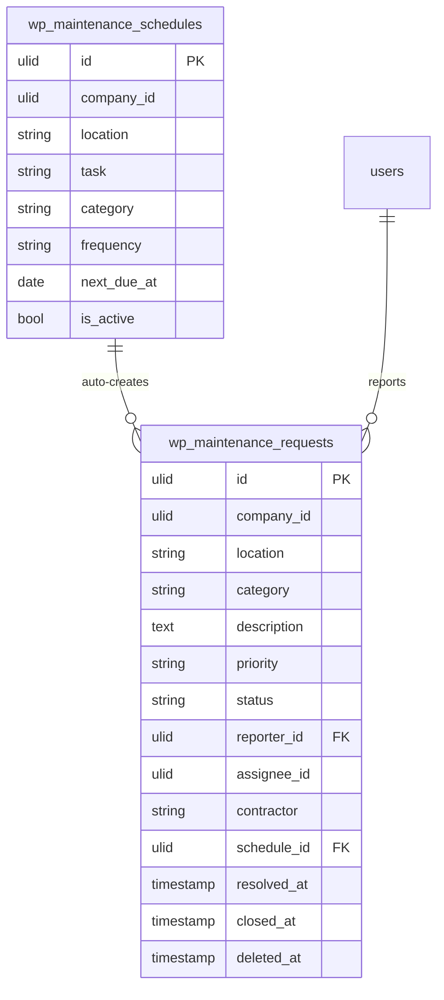

# Facility Maintenance — Data Model

## `wp_maintenance_requests`

| Column | Type | Notes |
|---|---|---|
| `id` | ulid | PK |
| `company_id` | ulid | Indexed, `BelongsToCompany` |
| `location` | string | |
| `category` | string | HVAC / electrical / plumbing / cleaning / furniture / safety |
| `description` | text | |
| `priority` | string | urgent / high / normal / low |
| `status` | string | state machine (default `reported`) |
| `reporter_id` | ulid | FK → `users` |
| `assignee_id` | ulid nullable | staff |
| `contractor` | string nullable | external (free-text *(assumed)*) |
| `schedule_id` | ulid nullable | preventive origin → `wp_maintenance_schedules` |
| `resolved_at` / `closed_at` | timestamp nullable | |
| `deleted_at` | timestamp nullable | `SoftDeletes` |

## `wp_maintenance_schedules`

| Column | Type | Notes |
|---|---|---|
| `id` | ulid | PK |
| `company_id` | ulid | Indexed, `BelongsToCompany` |
| `location` | string | |
| `task` | string | |
| `category` | string | in set |
| `frequency` | string | weekly / monthly / quarterly |
| `next_due_at` | date | advanced on run |
| `is_active` | boolean | |

## ERD

