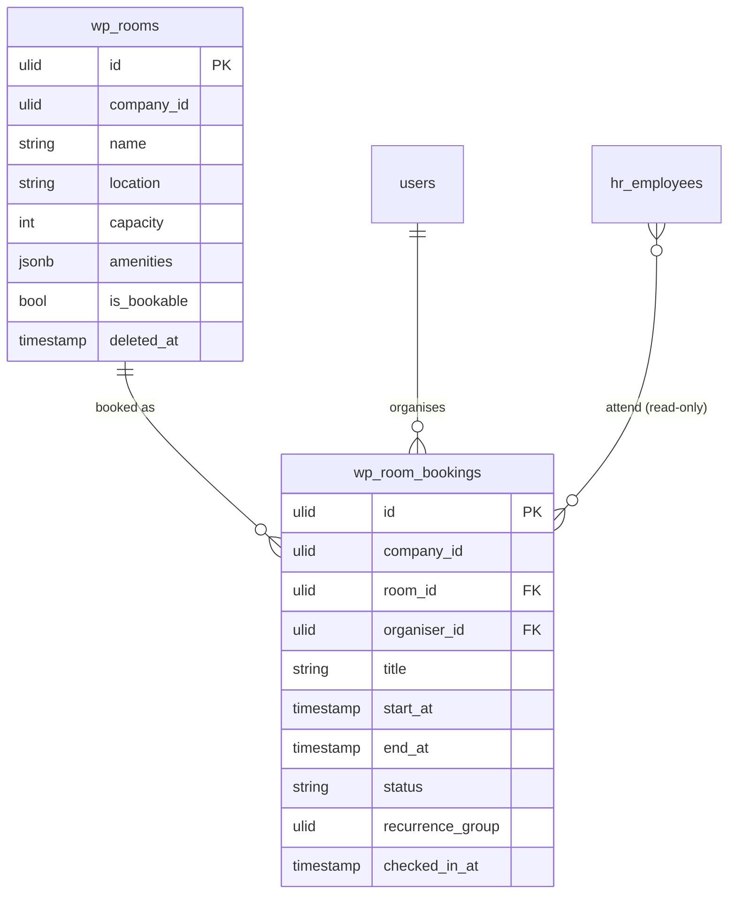

# Room Booking — Data Model

## `wp_rooms`

| Column | Type | Notes |
|---|---|---|
| `id` | ulid | PK |
| `company_id` | ulid | Indexed, `BelongsToCompany` |
| `name` | string | Unique per company |
| `location` | string | Floor / building |
| `capacity` | integer | Seats |
| `amenities` | jsonb | projector / whiteboard / video |
| `is_bookable` | boolean | Toggle |
| `deleted_at` | timestamp nullable | `SoftDeletes` |

## `wp_room_bookings`

| Column | Type | Notes |
|---|---|---|
| `id` | ulid | PK |
| `company_id` | ulid | Indexed, `BelongsToCompany` |
| `room_id` | ulid | FK → `wp_rooms` |
| `organiser_id` | ulid | FK → `users` |
| `title` | string | |
| `start_at` / `end_at` | timestamp | `end_at` after `start_at`; overlap-checked per room |
| `status` | string | confirmed / cancelled / released (default `confirmed`) |
| `recurrence_group` | ulid nullable | links materialised occurrences |
| `checked_in_at` | timestamp nullable | stamped on arrival |
| `created_at` / `updated_at` | timestamps | |

**Indexes:** `(company_id, room_id, start_at, end_at)`.

> Attendees are read from `hr.profiles`; whether they are persisted as a join row (`wp_room_booking_attendees`) or held only on the `.ics` invite is undocumented *(assumed: not persisted)* — see [[unknowns]].

## ERD

