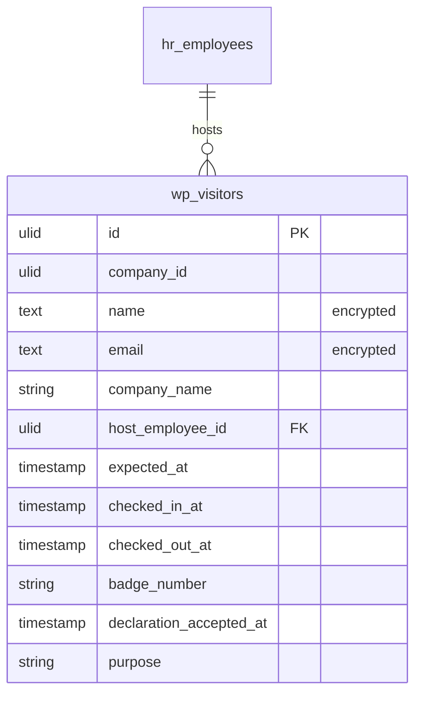

# Visitor Management — Data Model

## `wp_visitors`

| Column | Type | Notes |
|---|---|---|
| `id` | ulid | PK |
| `company_id` | ulid | Indexed, `BelongsToCompany` |
| 🔐 `name` | text | **encrypted cast** — external visitor PII |
| 🔐 `email` | text | **encrypted cast** — external visitor PII (nullable) |
| `company_name` | string | Visiting-from organisation |
| `host_employee_id` | ulid | FK → `hr_employees` |
| `expected_at` | timestamp | pre-registration slot |
| `checked_in_at` | timestamp nullable | |
| `checked_out_at` | timestamp nullable | |
| `badge_number` | string nullable | assigned at check-in |
| `declaration_accepted_at` | timestamp nullable | NDA acceptance |
| `purpose` | string nullable | |
| `created_at` / `updated_at` | timestamps | |

**Indexes:** `(company_id, expected_at)`.

**Encrypted fields:** `name`, `email` — stored `text`, `encrypted` cast ([[../../../security/encryption]]). Not searchable in plaintext; the kiosk lookup matches on today's expected visitors by decrypting in-memory *(assumed)* — see [[unknowns]].

## ERD

