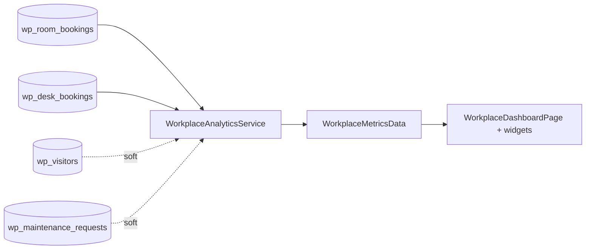

# Workplace Analytics — Data Model

**Owns no tables.** This module is a read-only aggregator; it persists nothing.

## Sources (read-only)

| Source table | Owner module | Metrics derived |
|---|---|---|
| `wp_room_bookings` | [[../room-booking/_module\|workplace.rooms]] | booking rate, no-show rate, peak hours |
| `wp_desk_bookings` | [[../desk-booking/_module\|workplace.desks]] | occupancy %, weekday attendance distribution |
| `wp_visitors` | [[../visitor-management/_module\|workplace.visitors]] | visitor volume (soft) |
| `wp_maintenance_requests` | [[../maintenance/_module\|workplace.maintenance]] | request volume, resolution time, by category (soft) |

## Output DTO

`WorkplaceMetricsData` (output only) carries the computed sections. See [[api]].

## Aggregation Flow (no ERD — no owned entities)

All arrows are **read-only queries** through the owning modules' read models — no writes ([[../../../security/data-ownership]]).
