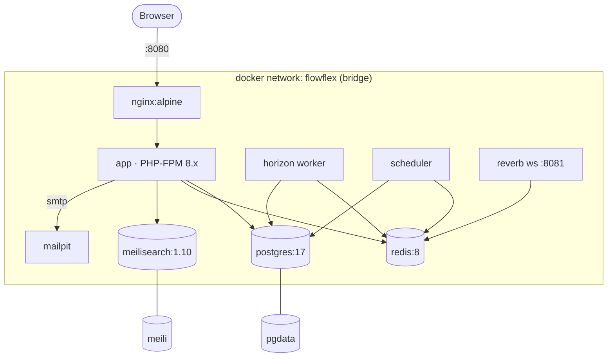

# Docker Stack — Local Development

The whole app runs as a **9-service** docker-compose stack defined in the repo-root
`docker-compose.yml`. The browser hits **nginx on host `:8080`**; everything else talks over
the internal `flowflex` bridge network. Verified against `docker-compose.yml` on 2026-06-20.

> [!note] Audit correction
> Earlier vault notes said "eight services" and listed `LocalAdminSeeder`/`LocalCompanySeeder`
> + host-published Mailpit/Redis/Meili. Reality below supersedes that (see [[../_audit/AUDIT|AUDIT]] E3–E7).

## Services

| Service | Image / build | Command | Host port | Purpose |
|---|---|---|---|---|
| `app` | build `./docker/php` (PHP-FPM) | (php-fpm) | — | Laravel app |
| `nginx` | `nginx:alpine` | — | **8080→80** | Web server / entrypoint |
| `postgres` | `postgres:17` | — | **5432→5432** | Primary DB (`flowflex`/`flowflex`/`secret`) |
| `redis` | `redis:8-alpine` | `--requirepass secret` | — (internal) | Cache / queue / session |
| `meilisearch` | `getmeili/meilisearch:v1.10` | — | **7700→7700** | Search (`MEILI_MASTER_KEY=masterKey`) |
| `mailpit` | `axllent/mailpit` | — | — (`expose` 1025/8025) | SMTP catcher |
| `horizon` | build `./docker/php` | `artisan horizon` | — | Queue worker |
| `scheduler` | build `./docker/php` | `artisan schedule:work` | — | Cron (health + queue heartbeat) |
| `reverb` | build `./docker/php` | `reverb:start --port=8081` | — (`expose` 8081) | WebSockets |

**Only `nginx:8080` and `postgres:5432` are published to the host.** Redis, Mailpit, and Reverb
are deliberately unpublished (host ports already occupied) — reach them via the internal network
(`redis:6379`, `mailpit:1025`, `reverb:8081`) or temporarily publish a free host port.

- **Network:** `flowflex` (bridge). **Volumes:** `pgdata`, `meili`.
- **Build context:** `app`, `horizon`, `scheduler`, `reverb` all build from `./docker/php/Dockerfile`
  (+ `php.ini`); nginx config is `./docker/nginx/default.conf`.
- **Healthchecks:** postgres (`pg_isready`) and redis (`redis-cli ping`) gate `app` startup.
- **Live sync:** `app` uses compose `develop.watch` to sync `./app` (ignoring `vendor/`, `node_modules/`).

## Runtime driver wiring

Drivers are set by the compose `x-app-env` block (NOT by `.env.example` — see [[secrets-env]]):

| Concern | Driver | Target |
|---|---|---|
| DB | `pgsql` | `postgres:5432` db `flowflex` |
| Cache / Queue / Session | `redis` (phpredis) | `redis:6379` |
| Mail | `smtp` | `mailpit:1025` |
| Search | `meilisearch` | `http://meilisearch:7700` |

Tests run on **SQLite `:memory:`** (see [[database]] + `app/phpunit.xml`), not this stack.

## Topology

## Operating it

- `docker compose up -d` — start all 9 services.
- `docker compose exec app php artisan migrate:fresh --seed` — seed the **container** pgsql DB
  (host CLI hits sqlite, not the container — see [[database]]).
- Quick logins (from [[../domains/foundation/permissions-seed/_module|LocalDevSeeder]]):
  `test@test.nl` / `test1234` (staff admin **and** tenant owner), `admin@flowflex.nl` / `password`,
  `demo@flowflex.nl` / `password`.

## Related

- [[database]] · [[cache-redis]] · [[queue-horizon]] · [[search-meilisearch]] · [[websockets-reverb]] · [[mail]]
- [[secrets-env]] · [[deployment]] · [[_moc|Infrastructure MOC]]
- [[../domains/foundation/docker-environment/_module|foundation/docker-environment spec]] (the module spec this verifies)
