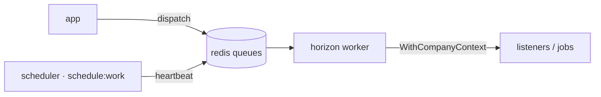

# Queues — Redis + Horizon

Async work runs on **Redis queues** processed by a dedicated **`horizon`** container
(`php artisan horizon`); a separate **`scheduler`** container runs `schedule:work` (per-minute
health checks + a queue heartbeat that keeps the status page's `QueueCheck` green).

- `QUEUE_CONNECTION=redis` (docker runtime).
- Horizon config: `app/config/horizon.php`. Queue names (verify in config):
  `domain-events, notifications, hr, finance, webhooks, exports, imports, default`.

> [!note] The `hr` and `finance` queue names predate the [[../decisions/decision-2026-06-19-strip-to-app-admin-shell|strip]].
> No domain code dispatches to them today; they re-activate when those domains are rebuilt. Harmless empties.

## Conventions

- Event listeners: `implements ShouldQueue` + `WithCompanyContext` middleware (rehydrates tenant
  context inside the worker — the queue has no session). See [[../security/tenancy-isolation]] and
  [[../domains/foundation/multi-tenancy-layer/_module]].
- Idempotent jobs; tenant `company_id` carried as a scalar on every event payload (never a model).
- Cross-cutting detail: [[../architecture/queue-jobs]], [[../architecture/event-bus]].

## Related

- [[cache-redis]] · [[docker-stack]] · [[websockets-reverb]] · [[_moc|Infrastructure MOC]]
