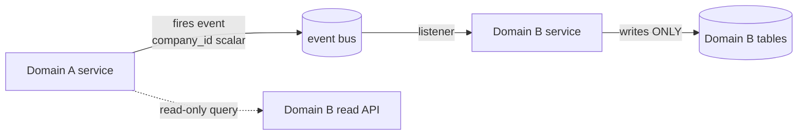

# Data Ownership & Bounded Contexts

The hard rule that keeps domains from corrupting or escalating across each other: **a service only ever
writes the tables its own module owns.** Cross-domain data flow is read-only-query or event-driven — never
a direct write into another domain's tables.

## The rule

| Action | Allowed? |
|---|---|
| Module writes **its own** tables (its `tables:` frontmatter) | ✅ yes |
| Module **reads** another domain's data via that domain's service/query API | ✅ yes (read-only) |
| Module reacts to another domain's **event** and writes **its own** tables | ✅ yes |
| Module **writes** another domain's tables directly | ⛔ never — security + integrity violation |
| Two modules both claim write-ownership of the same table | ⛔ never — ambiguous audit + privilege leak |

## Why it's a security control, not just tidiness

- **Privilege containment**: a bug or compromise in domain A cannot mutate domain B's data — the write path
  doesn't exist. Bounded contexts are blast-radius walls.
- **Audit integrity**: every write to a table has exactly one responsible service → the activity log +
  ownership are unambiguous.
- **Tenant isolation compounding**: writes always go through the owning service, which always runs under
  [[tenancy-isolation|CompanyContext]] — no side-door that skips the company scope.

## How cross-domain effects happen instead

- **Write side-effects** → the owning domain fires an event ([[../architecture/event-bus]]); the interested
  domain's **own** listener updates its **own** tables. Events carry `company_id` as a scalar + IDs, never
  models.
- **Reads** → call the owning module's service / read model. If a domain needs a fast local copy, it keeps a
  **denormalised projection** it owns, refreshed from events (it still only writes its own copy).
- **Shared reference data** (currencies, tax rates, countries) is owned by exactly one module; others read it.

## Enforcement (at build)

- Arch test: a `Services/{Domain}` class references only `Models/{Domain}` (+ platform models). Cross-domain
  Model writes fail the test.
- Listeners `implements ShouldQueue` + `WithCompanyContext`; write only their own domain's models.
- Every table appears in exactly one module's `tables:` frontmatter (checked across the vault).

## Related

- [[tenancy-isolation]] · [[authn-authz]] · [[../architecture/event-bus]] · [[../architecture/cross-domain-relations]]
- [[../decisions/decision-2026-06-20-full-mapping-conventions]] · [[_moc|Security MOC]]
